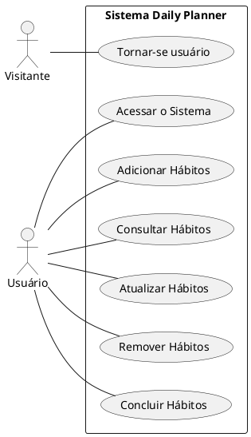
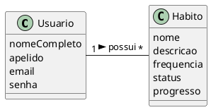

# Sistema Daily Planner

Daily Planner é um aplicativo onde seus usuários podem controlar, manter e organizar seus hábitos diários. 

## 1. Diagrama de casos de uso

## 2. Descrições dos casos de uso

### 2.1. Tornar-se usuário (CDU001)
**Resumo:** Um visitante tem a opção de tornar-se usuário. Tornando-se um usuário, ele poderá controlar, manter e organizar seus hábitos diários. 

**Ator principal:** Visitante

**Pré-condições:** Nenhuma

**Pós-condições:** O visitante está registrado como usuário e consegue acessas as funções disponíveis aos usuários do sistema.

#### Fluxo Principal
1. O visitante seleciona a opção de tornar-se um usuário.
2. O sistema solicita os dados iniciais para o registro: nome completo, apelido e e-mail que gostaria de utilizar para acessar o sistema.
3. O visitante fornece os dados solicitados.
4. O sistema verifica se o e-mail informado já não foi utilizado.
5. O sistema solicita que o visitante escolha uma senha com no mínimo 6 caracteres e no máximo 10 caracteres, fornecendo-a duas vezes para confirmação.
6. O sistema verifica se a senha atende os critérios apresentados e que as duas entradas da senha coincidem.
7. O sistema registra o visitante como usuário.
8. O sistema informa o visitante de que ele está registrado e pode acessar o sistema.

#### Fluxos de exceção

##### Passo 4 (e-mail não está disponível):
* O sistema verifica que o e-mail inserido já está sendo utilizado e solicita que o visitante escolha outro. O caso de uso retorna para o passo 3 do fluxo principal.
* O sistema verifica que o e-mail inserido já está sendo utilizado e sugere ao visitante solicitar a recuperação de senha. 

##### Passo 5 (senha não tem no mínimo 6 caracteres e no máximo 10 caracteres):
* O sistema verifica que a senha escolhida não atende os critérios apresentados e solicita que o visitante escolha outra senha. O caso de uso retorna para o passo 5 do fluxo principal.

##### Passo 6 (as duas entradas da senha não conferem):
* O sistema verifica que as duas entradas da senha não conferem e solicita que o visitante preencha novamente os campos com a senha desejada. O caso de uso retorna para o passo 5 do fluxo principal.

#### 2.2. Acessar o Sistema (CDU002)

**Resumo:** Para poder controlar, manter e organizar seus hábitos diários, o usuário deve se autenticar.

**Ator principal:** Usuário

**Pré-condições:** O visitante já deve ser um usuário registrado.

**Pós-condições:** O usuário terá acesso as funções disponíveis do sistema.

#### Fluxo Principal
1. O usuário seleciona a opção de entrar no aplicativo.
2. O sistema solicita que o usuário forneça seu e-mail e sua senha.
3. O usuário fornece seu e-mail e sua senha.
4. O sistema verifica se o e-mail e senha correspondem as informações de um de seus usuários registrados.
5. O sistema verifica que a senha atende os critérios apresentados.
6. O sistema inicia e apresenta a tela inicial com os hábitos já adicionados e a opção de criar um novo hábito.

#### Fluxos de exceção

##### Passo 4 (e-mail  e/ou senha inválidos):
* O sistema verifica que o e-mail e a senha não correspondem as informações de um de seus usuários registrados e solicita que o usuário entre novamente com as informações. O caso de uso retorna para o passo 2 do fluxo principal.

#### 2.3. Adicionar Hábitos (CDU003)

**Resumo:** O usuário irá adicionar um novo hábito ao seu controle diário, registrando o nome do hábito e sua recorrência.

**Ator principal:** Usuário

**Pré-condições:** O usuário está registrado e autenticado no sistema.

**Pós-condições:** O hábito será adicionado a lista de hábitos e estará disponível para acompanhamento e modificação.

#### Fluxo Principal
1. O usuário seleciona a opção de adicionar um novo hábito na tela inicial.
2. O sistema exibe um formulário para o usuário preencher as informações do novo hábito e sua frequência nos dias da semana. 
3. O usuário preenche todas as informações necessárias no formulário.
4. O usuário confirma a criação do novo hábito clicando no botão "Confirmar".
5. O sistema valida as informações fornecidas, garantindo que todos os campos obrigatórios estão preenchidos corretamente.
6. O sistema adiciona o novo hábito à lista de hábitos do usuário.
7. O sistema exibe a tela inicial atualizada com o novo hábito incluído.

#### Fluxos de exceção

##### Passo 5 (informações inválidas ou incompletas):
* Se o sistema detectar que alguma informação obrigatória está faltando ou é inválida (por exemplo, nome do hábito não preenchido ou frequência não selecionada), o sistema exibe uma mensagem de erro informando o problema. O caso de uso retorna para o passo 2 do fluxo principal.

#### 2.4. Consultar Hábitos (CDU004)

**Resumo:** O usuário visualiza a lista de hábitos que já foram registrados no sistema, com a opção de ver detalhes, acompanhar o progresso, e realizar modificações se necessário.

**Ator principal:** Usuário

**Pré-condições:** O usuário está registrado e autenticado no sistema.

**Pós-condições:** O usuário visualizará a lista de hábitos, incluindo informações detalhadas e progresso, além de ter a opção de editar ou deletar hábitos.

#### Fluxo Principal
1. O usuário acessa a tela inicial do aplicativo, onde são listados todos os hábitos registrados.
2. O sistema exibe a lista de hábitos com suas informações básicas, como nome e frequência.
3. O usuário seleciona um hábito específico para visualizar mais detalhes.
4. O sistema exibe os detalhes completos do hábito selecionado, incluindo nome e frequência.
5. O usuário pode optar por voltar a lista de hábitos, editar o hábito selecionado ou excluí-lo.

#### Fluxo de exceção

##### Passo 5 (erro ao carregar detalhes do hábito):
* Se ocorrer um erro ao tentar carregar os detalhes de um hábito, o sistema informa o usuário sobre o problema e retorna a lista de hábitos. O caso de uso retorna para o passo 2 do fluxo principal.

#### 2.5. Atualizar Hábitos (CDU005)

**Resumo:** O usuário modifica as informações de um hábito existente, como o nome e frequência, para manter o controle atualizado e visualizar mudanças em sua rotina.

**Ator principal:** Usuário

**Pré-condições:** O usuário está registrado e autenticado no sistema.

**Pós-condições:** O hábito selecionado será atualizado com as novas informações fornecidas pelo usuário.

#### Fluxo Principal
1. O usuário acessa a lista de hábitos na tela inicial.
2. O usuário seleciona o hábito que deseja atualizar.
3. O sistema exibe os detalhes completos do hábito selecionado, incluindo todas as informações editáveis.
4. O usuário escolhe a opção de editar o hábito.
5. O sistema exibe um formulário preenchido com as informações atuais do hábito.
6. O usuário modifica as informações desejadas, como nome e/ou frequência.
7. O usuário confirma as alterações clicando no botão "Confirmar".
8. O sistema valida as novas informações fornecidas, garantindo que todo o formulário está preenchidos corretamente.
9. O sistema atualiza o hábito com as novas informações.
10. O sistema retorna a tela inicial com o hábito atualizado.

#### Fluxo de exceção

##### Passo 8 (informações inválidas ou incompletas):
* Se o sistema detectar que alguma informação obrigatória está faltando ou é inválida, o sistema exibe uma mensagem de erro informando o problema. O caso de uso retorna para o passo 5 do fluxo principal.

#### 2.6. Remover Hábitos (CDU006)

**Resumo:** O usuário deseja excluir um hábito que não é mais necessário ou relevante, excluindo permanentemente de sua lista de hábitos no sistema.

**Ator principal:** Usuário.

**Pré-condições:** O usuário está registrado e autenticado no sistema.

**Pós-condições:** O hábito selecionado será removido da lista de hábitos do usuário.

#### Fluxo Principal
1. O usuário acessa a lista de hábitos na tela inicial.
2. O usuário seleciona o hábito que deseja remover.
3. O sistema exibe os detalhes completos do hábito selecionado.
4. O usuário escolhe a opção de excluir o hábito.
5. O sistema exibe uma mensagem de confirmação, perguntando se o usuário realmente deseja remover o hábito.
6. O usuário confirma a exclusão do hábito.
7. O sistema remove o hábito da lista de hábitos do usuário.
8. O sistema retorna à tela inicial com a lista de hábitos atualizada.

#### Fluxo de exceção

##### Passo 6 (usuário cancela a exclusão):
* Se o usuário decidir não excluir o hábito, ele pode cancelar na mensagem de confirmação.
O caso de uso retorna para o passo 1 do fluxo principal.

##### Passo 7 (erro ao remover o hábito):
* Se ocorrer um erro durante o processo de remoção do hábito, o sistema informa sobre o problema e sugere que o usuário tente novamente. O caso de uso retorna para o passo 3 do fluxo principal.novamente.

#### 2.7. Concluir Hábitos (CDU007)

**Resumo:** O usuário marca um hábito como concluído para registrar seu progresso e manter o controle de seus hábitos diários.

**Ator principal:** Usuário.

**Pré-condições:** O usuário está registrado e autenticado no sistema.

**Pós-condições:** O hábito selecionado será marcado como concluído e o progresso será atualizado.

#### Fluxo Principal
1. O usuário acessa a lista de hábitos na tela inicial.
2. O usuário identifica o hábito que deseja marcar como concluído.
3. O usuário seleciona a opção para concluir o hábito (botão de check).
4. O sistema registra o hábito como concluído para o dia ou período especificado.
5. O sistema atualiza o status do hábito na lista, indicando que ele foi concluído.
6. O sistema atualiza o progresso do usuário, refletindo a conclusão do hábito.
7. O sistema exibe uma mensagem informando que o hábito foi concluído.

#### Fluxo de exceção

##### Passo 4 (erro ao registrar a conclusão):
* Se ocorrer um erro durante o processo de marcar o hábito como concluído, o sistema informa o sobre o problema e sugere que o usuário tente novamente. O caso de uso retorna para o passo 2 do fluxo principal.

## 3. Modelo de domínio

## 4. Diagramas de sequência

## 5. Diagramas de classes de projeto